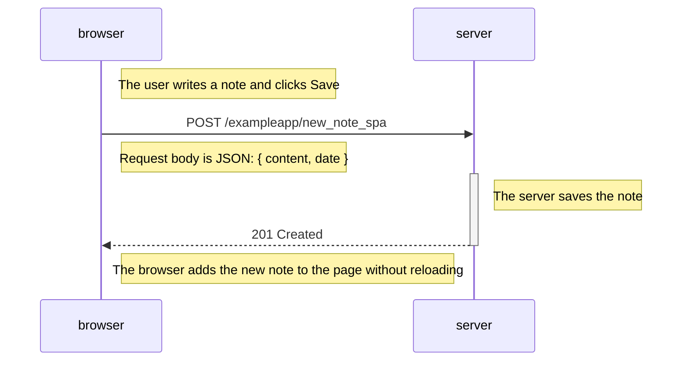

```mermaid
sequenceDiagram
    participant browser
    participant server

    Note right of browser: The user writes a note and clicks Save
    browser->>server: POST /exampleapp/new_note_spa
    Note right of browser: Request body is JSON: { content, date }
    activate server
    Note right of server: The server saves the note
    server-->>browser: 201 Created
    deactivate server

    Note right of browser: The browser adds the new note to the page without reloading
```